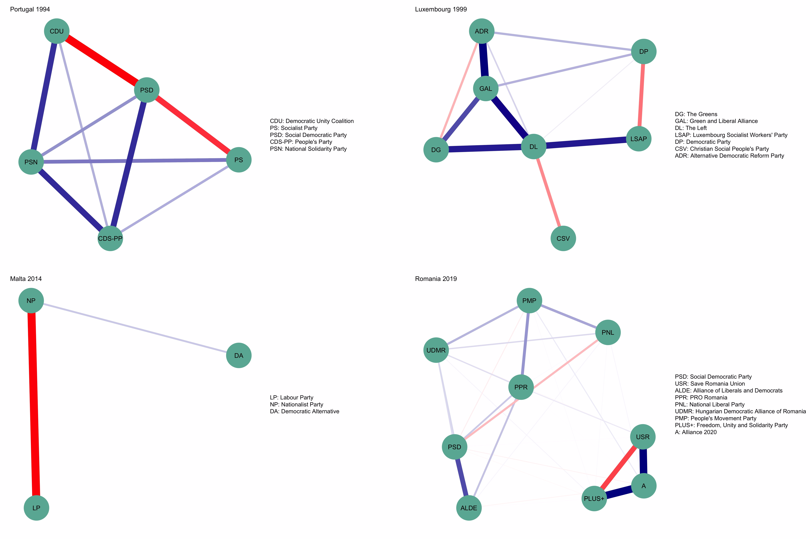

<style>
body {
text-align: justify}
</style>

```{r Setup, message=FALSE, warning=FALSE, include=FALSE}
knitr::opts_chunk$set(echo = FALSE, error = FALSE, message = FALSE, warning = FALSE, results = 'asis')
```

This document present all additional analysis relative to the paper. We present descriptive statistics on sample sizes, additional figures on the aggregated distribution of network characteristics and full models of the coincise versions shown in the article. We also provide additional models regarding: the results of alternative network estimation (GGM, correlational networks); alternative network measures (mean constraint; integer ratio of negative to positive edges); different dependent variables (national turnout). 

```{r}
library("pacman")
p_load(tidyverse, here, haven, countrycode, vdemdata, psych, lavaan, ltm, magick, html2latex,
       janitor, conflicted, sjPlot, BMA, BMS, fastDummies, ggplot2, reshape2, ggeffects,
       hrbrthemes, viridis, ggrepel, jtools, patchwork, kableExtra, bootnet, qgraph, webshot)

#conflicts
conflict_prefer("select", "dplyr")
conflict_prefer("filter", "dplyr")
```

```{r}
# import final data
data = read_rds(here("Input", "final_data", "final.rds"))

#as factor
data$country = as.factor(data$country)
data$year = as.factor(data$year)
data$country_year = as.factor(data$country_year)
```


# Table 1 
```{r}
#data from "2_EES_Models.Rmd"
Year = c(1989,1994,1999,2004,2009,2014,2019,"Total")
n = c(9755,10546,11381,19435,23186,22850,24806,121959)

#Table_1 
Table_1 = data_frame(Year, n)

# Print the table in a nice format
kable(Table_1, caption = "Table 1: Sample sizes by year", col.names = c("Year", "Observations"), format = "latex", booktabs = TRUE)
```


```{r}
# data preparation
violin_data = data %>% 
  select("EES_COR_constraint", "EES_GGM_huge_constraint", "EES_GGM_glasso_constraint") 

long_violin_data = melt(violin_data, variable.name = "Model", value.name = "Value")

# violin plot

# Calculate the sample sizes
sample_size <- long_violin_data %>% group_by(Model) %>% summarize(num=n())

# Join the sample and violin data 
plot_data <- long_violin_data %>%
  left_join(sample_size, by = "Model") %>%
  mutate(myaxis = paste0(Model, "\n", "n=", num))

# Create the plot
violin_plot <- ggplot(plot_data, aes(x=myaxis, y=Value, fill=Model)) +
  geom_violin(position=position_dodge(width=0.25), width=0.8) +
  geom_boxplot(width=0.1, color="grey", alpha=0.2, position=position_dodge(width=0.25)) +
  scale_fill_viridis(discrete = TRUE) +
  theme_ipsum(base_size = 14) +
  theme(
    legend.position = "none",
    plot.title = element_text(size=14)
  ) +
  labs(title="Aggregated distribution of Constraint", x="", y="Constraint") +
  scale_x_discrete(labels=c("Correlation", "Glasso", "Huge"))

```

```{r}
# data preparation
violin_data_aspl = data %>% 
  select("EES_COR_aspl", "EES_GGM_huge_aspl", "EES_GGM_glasso_aspl") 

long_violin_data_aspl = melt(violin_data_aspl, variable.name = "Model", value.name = "Value")

# violin plot

# Calculate the sample sizes
sample_size <- long_violin_data_aspl %>% group_by(Model) %>% summarize(num=n())

# Join the sample and violin data 
plot_data_aspl <- long_violin_data_aspl %>%
  left_join(sample_size, by = "Model") %>%
  mutate(myaxis = paste0(Model, "\n", "n=", num))

# Create the plot
violin_plot_aspl <- ggplot(plot_data_aspl, aes(x=myaxis, y=Value, fill=Model)) +
  geom_violin(position=position_dodge(width=0.25), width=0.8) +
  geom_boxplot(width=0.1, color="grey", alpha=0.2, position=position_dodge(width=0.25)) +
  scale_fill_viridis(discrete = TRUE) +
  theme_ipsum(base_size = 14) +
  theme(
    legend.position = "none",
    plot.title = element_text(size=14)
  ) +
  labs(title="Aggregated distribution of ASPL", x="", y="ASPL") +
  scale_x_discrete(labels=c("Correlation", "Glasso", "Huge"))

```

# Figure 1 
Aggregated frequency distribution of constraint and weighted ASPL, with outliers and original scales. 

 

# Figure 2 
Aggregated frequency distribution of constraint and weighted ASPL, without outliers. 

```{r}
#robustness: remove outliers from aspl

# filter outliers
num_sd <- 3

# cor
# Calculate mean and sd
mean_aspl <- mean(data$EES_COR_aspl, na.rm = TRUE)
sd_aspl <- sd(data$EES_COR_aspl, na.rm = TRUE)

# Filter out outliers
data <- data %>%
  filter(EES_COR_aspl > (mean_aspl - num_sd * sd_aspl) & EES_COR_aspl < (mean_aspl + num_sd * sd_aspl))

# glasso
# Calculate mean and sd
mean_aspl <- mean(data$EES_GGM_glasso_aspl, na.rm = TRUE)
sd_aspl <- sd(data$EES_GGM_glasso_aspl, na.rm = TRUE)

# Filter out outliers
data <- data %>%
  filter(EES_GGM_glasso_aspl > (mean_aspl - num_sd * sd_aspl) & EES_GGM_glasso_aspl < (mean_aspl + num_sd * sd_aspl))

# huge
# Calculate mean and sd
mean_aspl <- mean(data$EES_GGM_huge_aspl, na.rm = TRUE)
sd_aspl <- sd(data$EES_GGM_huge_aspl, na.rm = TRUE)

# Filter out outliers
data <- data %>%
  filter(EES_GGM_huge_aspl > (mean_aspl - num_sd * sd_aspl) & EES_GGM_huge_aspl < (mean_aspl + num_sd * sd_aspl))

```

```{r}
# data preparation
violin_data = data %>% 
  select("EES_COR_constraint", "EES_GGM_huge_constraint", "EES_GGM_glasso_constraint") 

long_violin_data = melt(violin_data, variable.name = "Model", value.name = "Value")

# violin plot

# Calculate the sample sizes
sample_size <- long_violin_data %>% group_by(Model) %>% summarize(num=n())

# Join the sample and violin data 
plot_data <- long_violin_data %>%
  left_join(sample_size, by = "Model") %>%
  mutate(myaxis = paste0(Model, "\n", "n=", num))

# Create the plot
violin_plot <- ggplot(plot_data, aes(x=myaxis, y=Value, fill=Model)) +
  geom_violin(position=position_dodge(width=0.25), width=0.8) +
  geom_boxplot(width=0.1, color="grey", alpha=0.2, position=position_dodge(width=0.25)) +
  scale_fill_viridis(discrete = TRUE) +
  theme_ipsum(base_size = 14) +
  theme(
    legend.position = "none",
    plot.title = element_text(size=14)
  ) +
  labs(title="Aggregated distribution of Constraint", x="", y="Constraint") +
  scale_x_discrete(labels=c("Correlation", "Glasso", "Huge"))

```

```{r}
# data preparation
violin_data_aspl = data %>% 
  select("EES_COR_aspl", "EES_GGM_huge_aspl", "EES_GGM_glasso_aspl") 

long_violin_data_aspl = melt(violin_data_aspl, variable.name = "Model", value.name = "Value")

# violin plot

# Calculate the sample sizes
sample_size <- long_violin_data_aspl %>% group_by(Model) %>% summarize(num=n())

# Join the sample and violin data 
plot_data_aspl <- long_violin_data_aspl %>%
  left_join(sample_size, by = "Model") %>%
  mutate(myaxis = paste0(Model, "\n", "n=", num))

# Create the plot
violin_plot_aspl <- ggplot(plot_data_aspl, aes(x=myaxis, y=Value, fill=Model)) +
  geom_violin(position=position_dodge(width=0.25), width=0.8) +
  geom_boxplot(width=0.1, color="grey", alpha=0.2, position=position_dodge(width=0.25)) +
  scale_fill_viridis(discrete = TRUE) +
  theme_ipsum(base_size = 14) +
  theme(
    legend.position = "none",
    plot.title = element_text(size=14)
  ) +
  labs(title="Aggregated distribution of ASPL", x="", y="ASPL") +
  scale_x_discrete(labels=c("Correlation", "Glasso", "Huge"))

```

 

# Figure 3
Temporal development of constraint, by country, without outliers (5 cases were outliers with respect to the ASPL aggregated frequency distribution. Hence, n lowered from 143 to 138 for both connectivity measures).

```{r fig.width=16, fig.height=8}
# data
cons_trend <- data %>%
  select(year, country, EES_COR_constraint, EES_GGM_huge_constraint, EES_GGM_glasso_constraint) 

long_cons_trend = melt(cons_trend, variable.name = "Model", value.name = "Value")


# Plot
Fig_2 = long_cons_trend %>%
  ggplot(aes(x = year, y = Value, group = interaction(country, Model), color = Model)) +
  geom_line() +
  geom_point() +
  facet_wrap(~country) +  
  scale_color_viridis_d(labels = c("Correlation", "Glasso", "Huge")) +  
  theme_ipsum() +
  theme(
    legend.position = "bottom",
    axis.text.x = element_text(size = 9),
    axis.title.x = element_text(hjust = 0.5)) +
  labs(
    title = "Temporal Development of Constraint",
    x = "Year", 
    y = "Constraint",
    color = "Model Type"
  )

```

 

# Figure 4
Temporal development of weighted ASPL, by country, without outliers.

```{r fig.width=16, fig.height=8}
# data
aspl_trend <- data %>%
  select(year, country, EES_COR_aspl, EES_GGM_huge_aspl, EES_GGM_glasso_aspl) 

long_aspl_trend = melt(aspl_trend, variable.name = "Model", value.name = "Value")


#graph
Fig_3 = long_aspl_trend %>%
  ggplot(aes(x = year, y = Value, group = interaction(country, Model), color = Model)) +
    geom_line() +
    geom_point() +
    facet_wrap(~country) +  
    scale_color_viridis_d(labels = c("Correlation", "Glasso", "Huge")) + 
    theme_ipsum() +
    theme(
    legend.position = "bottom",
    axis.text.x = element_text(size = 9),
    axis.title.x = element_text(hjust = 0.5)) +
    labs(title = "Temporal Development of ASPL",
         x = "Year", 
         y = "ASPL",
         color = "Model Type") 

```

 

# Figure 5 
Scatterplot between weighted ASPL and constraint. This figure shows the two measures strongly correlate. This motivates our choice to focus on ASPL only in the main article. Results for constraint are shown here in following regression tables. Figure 6 shows country-year cases in which the two connectivity measures show moderatly high discrepancies. 

```{r}
#data_scatt
data_scatt <- data %>%
  mutate(
    iso2c = countrycode(substr(country_year, 1, 3), "iso3c", "iso2c"),
    year = substr(country_year, 7, 8),
    country_year_modified = paste(iso2c, year, sep = "_")
  )

# Identify extreme points
extreme_points <- data_scatt %>%
  filter(
    EES_GGM_huge_constraint == max(EES_GGM_huge_constraint) | 
    EES_GGM_huge_constraint == min(EES_GGM_huge_constraint) |
    EES_GGM_huge_aspl == max(EES_GGM_huge_aspl) | 
    EES_GGM_huge_aspl == min(EES_GGM_huge_aspl))

#Plot with labels
Fig_4 = ggplot(data_scatt, aes(x = EES_GGM_huge_constraint, y = EES_GGM_huge_aspl)) +
  geom_point(size = 1) +  
  geom_smooth(method = lm, color = "pink", fill = "#69b3a2", se = TRUE) +
  theme_ipsum(base_size = 14) +
  labs(
    x = "Constraint",
    y = "ASPL"
  ) +
  geom_label_repel(
    data = extreme_points, 
    aes(label = country_year_modified), 
    size = 3,  
    box.padding = 0.3,  
    point.padding = 0.5,  
    label.size = 0.25,  
    fill = 'white',  
    color = 'black' 
  ) +
  theme_ipsum() +
  theme(
    axis.title.x = element_text(size = 14),  
    axis.title.y = element_text(size = 14)  
  )

```

 

# Figure 6
This figure shows the networks of the highlighted cases of Figure 5. These are the few cases where ASPL and constraint diverge in measuring connectedness of PTV networks. The networks represent GGM-Huge networks where blue (red) edges are indicative of positive (negative) regularized partial correlations. This figure shows ASPL can better capture the topology of a network. When calculating mean constraint, edges are considered equals irrespectively or their network location. On the contrary, ASPL takes into account the positioning of these associations. Therefore, this measure "punihses" more the networks that are more segregated or clusterized (e.g.: Luxenburg and Romania). 

 

```{r}
# np_w as absoulte value
data$EES_COR_np_w = abs(data$EES_COR_np_w)
data$EES_GGM_glasso_np_w = abs(data$EES_GGM_glasso_np_w)
data$EES_GGM_huge_np_w = abs(data$EES_GGM_huge_np_w)
```

```{r}
# rescale function
rescale01 <- function(x) {(x - min(x)) / (max(x) - min(x))}

# Manually applying the function
data$EES_GGM_glasso_aspl = rescale01(data$EES_GGM_glasso_aspl) 
data$EES_GGM_glasso_np_i = rescale01(data$EES_GGM_glasso_np_i) 
data$EES_GGM_glasso_np_w = rescale01(data$EES_GGM_glasso_np_w)
data$EES_GGM_huge_aspl = rescale01(data$EES_GGM_huge_aspl) 
data$EES_GGM_huge_np_i = rescale01(data$EES_GGM_huge_np_i) 
data$EES_GGM_huge_np_w = rescale01(data$EES_GGM_huge_np_w)
data$EES_COR_aspl = rescale01(data$EES_COR_aspl) 
data$EES_COR_np_i = rescale01(data$EES_COR_np_i) 
data$EES_COR_np_w = rescale01(data$EES_COR_np_w)
data$educ = rescale01(data$educ)
data$ideol = rescale01(data$ideol)
data$mass_mob = rescale01(data$mass_mob)
data$p_inst_k = rescale01(data$p_inst_k)
data$p_inst = rescale01(data$p_inst)
data$pint = rescale01(data$pint)
data$pola = rescale01(data$pola)
data$turnout = rescale01(data$turnout)
data$ENEP = rescale01(data$ENEP)
data$gallagher = rescale01(data$gallagher)
data$ihdi = rescale01(data$ihdi)
```

# Models 1 and 2
Model 1 and 2 are the one shown in the article. Here they are presented in their full form. These models have the ASPL of GGM-Huge networks ["EES_GGM_huge_aspl"] as the dependent variable. M1 has party institutionalization ["p_inst"], party polarization ["pola"], and political interest ["pint"] as main covariates; fixed effects for country and year are present as controls. M2 adds IHDI, ENEP and Gallagher's index to the list of controls. 

```{r}
M1 <- lm(EES_GGM_huge_aspl ~ p_inst + pola + pint + country + year , data = data)
M2 <- lm(EES_GGM_huge_aspl ~ p_inst + pola + pint + country + year + ENEP + gallagher + ihdi, data = data)

tab_model(
  list(M1, M2),
  show.p = TRUE,
  p.style = "stars",
  p.threshold = c(0.1, 0.05, 0.01),
  dv.labels = c("M1 (F.E.)", "M2 (Controls)"),
  collapse.ci = TRUE,
  show.aic = TRUE,
  title = "OLS models on ASPL of PTV networks",
  string.pred = " ",
  auto.label = FALSE,
  terms = c("p_inst", "pola", "pint"),
  pred.labels = c("Party institutionalization", "Political polarization", "Political interest"),
  file = here("Output", "Supplement", "reg_1.doc"))

```


# Models 3 and 4
M3 and M4 show the same model as in M2, but with the ASPL of GGM-Glasso and of Correlational network as the dependent variables. Notably, party institutionalization is not significant for correlational networks. At the contary, political interest is significant in M4. However, the other regularized partial correlation network model (GGM-Glasso, M3) confirms the role of political institutionalization and polarization.

```{r}
M3 <- lm(EES_GGM_glasso_aspl ~ p_inst + pola + pint + country + year + ENEP + gallagher + ihdi, data = data)

M4 <- lm(EES_COR_aspl ~ p_inst + pola + pint + country + year + ENEP + gallagher + ihdi, data = data)

tab_model(
  list(M3, M4),
  show.p = TRUE,
  p.style = "stars",
  p.threshold = c(0.1, 0.05, 0.01),
  dv.labels = c("M3 (glsso ASPL)", "M4 (correlation ASPL)"),
  collapse.ci = TRUE,
  show.aic = TRUE,
  title = "OLS fixed effects (country and years) on ASPL of PTV networks",
  string.pred = " ",
  auto.label = T,
  file = here("Output", "Supplement", "reg_2.doc"))
```

# Models 5-7
M5 and M6 present the same set of covariates of M2-M4, but with constraint as dependent variable. Constraint is calculated on every type of network model to ensure robustness of our results. Similarly to M3 and M4, the connectivity of plain correlational PTV networks is best predicted by levels of party polarization and political interest. The connectivity of GGM-Huge and GGM-glasso are associated with party institutionalization. As a general note, we remark that models regressing on constraint always show lower significance in terms of p-values. We interpret this recurring to the lower SD of constraint, if compared to the one of weighted ASPL (see Figure 2). Indeed, ASPL is a connectivity measure imported from network science. ASPL can better capture network topology when investigating the connectedness of a PTV network (see our explanation of Figure 5 above). This motivate our choice to focus on ASPL in the main article. 

```{r}
M5 <- lm(EES_GGM_huge_constraint ~ p_inst + pola + pint + country + year + ENEP + gallagher + ihdi, data = data)

M6 <- lm(EES_GGM_glasso_constraint ~ p_inst + pola + pint + country + year + ENEP + gallagher + ihdi, data = data)

M7 <- lm(EES_COR_constraint ~ p_inst + pola + pint + country + year + ENEP + gallagher + ihdi, data = data)

tab_model(
  list(M5, M6, M7),
  show.p = TRUE,
  p.style = "stars",
  p.threshold = c(0.1, 0.05, 0.01),
  dv.labels = c("M5 (huge constraint)", "M6 (glasso constraint)", "M7 (correlation constraint)"),
  collapse.ci = TRUE,
  show.aic = TRUE,
  title = "OLS fixed effects (country and years) on constraint of PTV networks",
  string.pred = " ",
  auto.label = T,
  file = here("Output", "Supplement", "reg_3.doc"))
```


```{r}
#import cses data (cleaned)
aff_pola = read_rds(here("Input", "final_data", "IV", "aff_pola_long.rds"))

#Merge with data
cses_cases <- aff_pola %>%
  inner_join(data, by = "country_year") %>% 
  rename(country = country.x,
         year = year.x)

#factor
cses_cases$year = as.factor(cses_cases$year)
cses_cases$country = as.factor(cses_cases$country)

# Modified rescale function to handle NA values
rescale01 <- function(x) {
  min_x <- min(x, na.rm = TRUE)
  max_x <- max(x, na.rm = TRUE)
  (x - min_x) / (max_x - min_x)
}

# Apply the rescale function to new columns, preserving NA values
cses_cases$PAP_partisans <- rescale01(cses_cases$PAP_partisans)
cses_cases$PAP_electorate <- rescale01(cses_cases$PAP_electorate)
cses_cases$LAP_partisans <- rescale01(cses_cases$LAP_partisans)
cses_cases$LAP_electorate <- rescale01(cses_cases$LAP_electorate)
```

# Models 8-11
M8 and M11 are shown in the short form in the main article, and are reported here in their full form. M8 and M9 regress on the weighted ratio of negative to positive edges. In M8, the model only controls for country and year fixed effects. In M9, ENEP, Gallagher's index, and IHDI are added as controls. M10 and M11 have the same structure, but regress on the integer version of the ratio measure.  

```{r}
M8 <- lm(EES_GGM_huge_np_w ~ p_inst + pola + pint + country + year, data = data)

M9 <- lm(EES_GGM_huge_np_w ~ p_inst + pola + pint + country + year +
           ENEP + gallagher + ihdi, data = data)

M10 <- lm(EES_GGM_huge_np_i ~ p_inst + pola + pint + country + year, data = data)

M11 <- lm(EES_GGM_huge_np_i ~ p_inst + pola + pint + country + year +
           ENEP + gallagher + ihdi, data = data)

tab_model(
  list(M8, M9, M10, M11),
  show.p = TRUE,
  p.style = "stars",
  p.threshold = c(0.1, 0.05, 0.01),
  dv.labels = c("M8 (Weighted, F.E.)", "M9 (Weighted, controls)", 
                "M10 (Integer, F.E.)", "M11 (Integer, controls)"),
  collapse.ci = TRUE,
  show.aic = TRUE,
  title = "OLS models on negative/positive ratio measures of PTV networks",
  string.pred = " ",
  auto.label = T,
  file = here("Output", "Supplement", "reg_4.doc"))
```

# Models 12-15
These models present robustness checks for the models shown above. All these models present the full list of covariates (as in M9 and M11). However, M12 regress on the weighted ratio of GGM-Glasso networks; M13 on the integer version of GGM-Glasso; M14 on the weighted ratio of correlational networks; M15 on its integer version. 

The combined interpretation of M8 to M15 reveals only political interest present a robust associations with the relative numbers of negative edges in the PTV networks. However, this result only occur with respect to correlational network. We intepret this as weak evidence of an association between country levels of political interest and PTV network negativity. In the next set of models, we show that affective polarization is the most important variable for predicting the entity of both weighted and integer negative to positive ratio measures. 

```{r}
M12 <- lm(EES_GGM_glasso_np_w ~ p_inst + pola + pint + country + year + ENEP + gallagher + ihdi, data = data)
M13 <- lm(EES_GGM_glasso_np_i ~ p_inst + pola + pint + country + year + ENEP + gallagher + ihdi, data = data)

M14 <- lm(EES_COR_np_w ~ p_inst + pola + pint + country + year + ENEP + gallagher + ihdi, data = data)
M15 <- lm(EES_COR_np_i ~ p_inst + pola + pint + country + year + ENEP + gallagher + ihdi, data = data)

tab_model(
  list(M12, M13, M14, M15),
  show.p = TRUE,
  p.style = "stars",
  p.threshold = c(0.1, 0.05, 0.01),
  dv.labels = c("M12 (glasso, weighted)", "M13 (glasso, integer)",
                "M14 (correlation, weighted)", "M15 (correlation, integer)"),
  collapse.ci = TRUE,
  show.aic = TRUE,
  title = "OLS fixed effects (country and years) on ratio measures of PTV networks",
  string.pred = " ",
  auto.label = T,
  file = here("Output", "Supplement", "reg_5.doc"))

```

# Models 16-18
These models are shown in the main article in their short form, and are reported here in the full form. These results are based on the subset of EES cases that are also present in CSES data. M16 regress on the ASPL of GGM-Huge networks; M17 on the weighted ratio of GGM-Huge networks; M18 on its integer version. Variables included in the models are: partisan affective polarization calculated on the electorate ["PAP_electorate"]; country and year fixed effects; ENEP, Gallagher's index; IHDI; political interest ["pint"].

```{r}
M16 <- lm(EES_GGM_huge_aspl ~ PAP_electorate  + country + year +
         ENEP + gallagher + ihdi + pint, data = cses_cases)
M17 <- lm(EES_GGM_huge_np_w ~ PAP_electorate  + country + year +
            ENEP + gallagher + ihdi + pint, data = cses_cases)
M18 <- lm(EES_GGM_huge_np_i ~ PAP_electorate  + country + year +
            ENEP + gallagher + ihdi + pint, data = cses_cases)

tab_model(
  list(M16, M17, M18),
  show.p = TRUE,
  p.style = "stars",
  p.threshold = c(0.1, 0.05, 0.01),
  dv.labels = c("M16 (ASPL)", "M17 (Weighted ratio)", "M18 (Integer ratio)"),
  collapse.ci = TRUE,
  show.aic = TRUE,
  title = "OLS fixed effects (country and years) on ASPL and ratio measures of PTV networks. CSES cases",
  string.pred = " ",
  auto.label = T,
  file = here("Output", "Supplement", "reg_6.doc"))

```

# Models 19-23
These models present additional analyses for CSES cases. M19, M20 and M21 are respectively identical to M16, M17 and M18. However, here we use measures of affective polarization calculated on partisans only ["PAP_partisans]". The significant association between PAP and weighted ratio shown in M17 does not replicate for PAP_partisans. 

```{r}
M19 <- lm(EES_GGM_huge_aspl ~ PAP_partisans  + country + year +
         ENEP + gallagher + ihdi + pint, data = cses_cases)
M20 <- lm(EES_GGM_huge_np_w ~ PAP_partisans  + country + year +
            ENEP + gallagher + ihdi + pint, data = cses_cases)
M21 <- lm(EES_GGM_huge_np_i ~ PAP_partisans  + country + year +
            ENEP + gallagher + ihdi + pint, data = cses_cases)

tab_model(
  list(M19, M20, M21),
  show.p = TRUE,
  p.style = "stars",
  p.threshold = c(0.1, 0.05, 0.01),
  dv.labels = c("M19 (Huge, ASPL)", "M20 (Huge, weighted ratio)", "M21 (Huge, integer ratio)"),
  collapse.ci = TRUE,
  show.aic = TRUE,
  title = "OLS fixed effects (country and years) on ASPL and ratio measures of PTV networks. CSES cases",
  string.pred = " ",
  auto.label = T,
  file = here("Output", "Supplement", "reg_7.doc"))

```

# Models 22-23
These models present robustness check for M20, and based on the subset of data that are present in CSES. We show that affective polarization calculated on the electorate ["PAP_electorate"] significantly predict the levels of the weighted ratio of negative to positive edges of the other two network models (GGM-Glasso, M22; Correlational network, M23).

```{r}
M22 <- lm(EES_GGM_glasso_np_w ~ PAP_electorate  + country + year +
         ENEP + gallagher + ihdi + pint, data = cses_cases)
M23 <- lm(EES_COR_np_w ~ PAP_electorate  + country + year +
         ENEP + gallagher + ihdi + pint, data = cses_cases)

tab_model(
  list(M22, M23),
  show.p = TRUE,
  p.style = "stars",
  p.threshold = c(0.1, 0.05, 0.01),
  dv.labels = c("M22 (Glasso, weighted ratio)", "M23 (Correlation, weighted ratio)"),
  collapse.ci = TRUE,
  show.aic = TRUE,
  title = "OLS fixed effects (country and years) on ASPL and ratio measures of PTV networks. CSES cases",
  string.pred = " ",
  auto.label = T,
  file = here("Output", "Supplement", "reg_8.doc"))
```

```{r}
# import final data
turnout = read_rds(here("Input", "final_data", "final_turnout.rds"))

#as factor
turnout$country = as.factor(turnout$country)
turnout$year = as.factor(turnout$year)
turnout$country_year = as.factor(turnout$country_year)
turnout$infla = as.numeric(turnout$infla)
turnout$mand = as.factor(turnout$mand)
```

```{r}
#robustness: remove outliers from turnout (zero)

# filter outliers
num_sd <- 3

# cor
# Calculate mean and sd
mean_turn <- mean(turnout$turnout, na.rm = TRUE)
sd_turn <- sd(turnout$turnout, na.rm = TRUE)

# Filter out outliers
turnout <- turnout %>%
  filter(turnout > (mean_turn - num_sd * sd_turn) & turnout < (mean_turn + num_sd * sd_turn))

```

```{r}
#robustness: remove outliers from np_i (7)

# filter outliers
num_sd <- 3

# cor
# Calculate mean and sd
mean_np <- mean(turnout$EES_COR_np_i, na.rm = TRUE)
sd_np <- sd(turnout$EES_COR_np_i, na.rm = TRUE)

# Filter out outliers
turnout <- turnout %>%
  filter(EES_COR_np_i > (mean_np - num_sd * sd_np) & EES_COR_np_i < (mean_np + num_sd * sd_np))

# glasso
# Calculate mean and sd
mean_np <- mean(turnout$EES_GGM_glasso_np_i, na.rm = TRUE)
sd_np <- sd(turnout$EES_GGM_glasso_np_i, na.rm = TRUE)

# Filter out outliers
turnout <- turnout %>%
  filter(EES_GGM_glasso_np_i > (mean_np - num_sd * sd_np) & EES_GGM_glasso_np_i < (mean_np + num_sd * sd_np))

# huge
# Calculate mean and sd
mean_np <- mean(turnout$EES_GGM_huge_np_i, na.rm = TRUE)
sd_np <- sd(turnout$EES_GGM_huge_np_i, na.rm = TRUE)

# Filter out outliers
turnout <- turnout %>%
  filter(EES_GGM_huge_np_i > (mean_np - num_sd * sd_np) & EES_GGM_huge_np_i < (mean_np + num_sd * sd_np))

```

```{r}
#robustness: remove outliers from np_w (10)

# filter outliers
num_sd <- 3

# cor
# Calculate mean and sd
mean_np <- mean(turnout$EES_COR_np_w, na.rm = TRUE)
sd_np <- sd(turnout$EES_COR_np_w, na.rm = TRUE)

# Filter out outliers
turnout <- turnout %>%
  filter(EES_COR_np_w > (mean_np - num_sd * sd_np) & EES_COR_np_w < (mean_np + num_sd * sd_np))

# glasso
# Calculate mean and sd
mean_np <- mean(turnout$EES_GGM_glasso_np_w, na.rm = TRUE)
sd_np <- sd(turnout$EES_GGM_glasso_np_w, na.rm = TRUE)

# Filter out outliers
turnout <- turnout %>%
  filter(EES_GGM_glasso_np_w > (mean_np - num_sd * sd_np) & EES_GGM_glasso_np_w < (mean_np + num_sd * sd_np))

# huge
# Calculate mean and sd
mean_np <- mean(turnout$EES_GGM_huge_np_w, na.rm = TRUE)
sd_np <- sd(turnout$EES_GGM_huge_np_w, na.rm = TRUE)

# Filter out outliers
turnout <- turnout %>%
  filter(EES_GGM_huge_np_w > (mean_np - num_sd * sd_np) & EES_GGM_huge_np_w < (mean_np + num_sd * sd_np))
```

# Figure 7 
Frequency distribution of EU and national turnouts, in percentages. The regression models of the second part of this research are based on a lower number of cases. As discussed in the article, EES data offer 143 country-year unit cases. However, we removed outliers for the integer version of the ratio measure (from 143 to 136 observations). We further remove outliers for the weighted measure (from 136 to 126 observations). In terms of statistical significance, results replicate with the full list of cases. However, additional analyses suggested us to remove these influential observations. The model we present perform better than the ones we performed in the full sample. 

```{r}
# Data preparation
violin_data_aspl = turnout %>% 
  select(turnout, turnout_nat)

# Reshape the data to long format
long_violin_data_aspl = melt(violin_data_aspl, variable.name = "Model", value.name = "Value")

# Calculate the sample sizes
sample_size <- long_violin_data_aspl %>% group_by(Model) %>% summarize(num = n())

# Join the sample and violin data
plot_data_aspl <- long_violin_data_aspl %>%
  left_join(sample_size, by = "Model") %>%
  mutate(myaxis = paste0(Model, "\n", "n=", num))

# Create the plot
violin_plot_turnout <- ggplot(plot_data_aspl, aes(x = myaxis, y = Value, fill = Model)) +
  geom_violin(position = position_dodge(width = 0.25), width = 0.8) +
  geom_boxplot(width = 0.1, color = "grey", alpha = 0.2, position = position_dodge(width = 0.25)) +
  scale_fill_viridis(discrete = TRUE) +
  theme_ipsum(base_size = 14) +
  theme(
    legend.position = "none",
    plot.title = element_text(size = 14)
  ) +
  labs(title = "Aggregated distribution of Turnout", x = "", y = "Turnout") +
  scale_x_discrete(labels = c("EU Turnout", "National Turnout"))
```

 


```{r}
# np_w as absoulte value
turnout$EES_COR_np_w = abs(turnout$EES_COR_np_w)
turnout$EES_GGM_glasso_np_w = abs(turnout$EES_GGM_glasso_np_w)
turnout$EES_GGM_huge_np_w = abs(turnout$EES_GGM_huge_np_w)
```

```{r}
# rescale function
rescale01 <- function(x) {(x - min(x)) / (max(x) - min(x))}

# Manually applying the function
turnout$EES_GGM_glasso_aspl = rescale01(turnout$EES_GGM_glasso_aspl) 
turnout$EES_GGM_glasso_np_i = rescale01(turnout$EES_GGM_glasso_np_i) 
turnout$EES_GGM_glasso_np_w = rescale01(turnout$EES_GGM_glasso_np_w)
turnout$EES_GGM_huge_aspl = rescale01(turnout$EES_GGM_huge_aspl) 
turnout$EES_GGM_huge_np_i = rescale01(turnout$EES_GGM_huge_np_i) 
turnout$EES_GGM_huge_np_w = rescale01(turnout$EES_GGM_huge_np_w)
turnout$EES_COR_aspl = rescale01(turnout$EES_COR_aspl) 
turnout$EES_COR_np_i = rescale01(turnout$EES_COR_np_i) 
turnout$EES_COR_np_w = rescale01(turnout$EES_COR_np_w)
turnout$educ = rescale01(turnout$educ)
turnout$ideol = rescale01(turnout$ideol)
turnout$mass_mob = rescale01(turnout$mass_mob)
turnout$p_inst_k = rescale01(turnout$p_inst_k)
turnout$p_inst = rescale01(turnout$p_inst)
turnout$pint = rescale01(turnout$pint)
turnout$pola = rescale01(turnout$pola)
turnout$ENEP = rescale01(turnout$ENEP)
turnout$gallagher = rescale01(turnout$gallagher)
turnout$ihdi = rescale01(turnout$ihdi)
turnout$turnout = rescale01(turnout$turnout)
turnout$turnout_nat = rescale01(turnout$turnout_nat)
```

# Models 24-26
The results of M24 are visualized in Figure 2 of the main article. This model has EU turnout as the dependent variable, and the weighted ratio of negative to positive edges of GGM-Huge PTV networks as the main predictor. Other variables included in the model are country and year fixed effects, IHDI, polarization, ENEP. M25 and M26 replicate the same analyses, but with the weighted ratio measures of GGM-Huge and correlational network respectively. The results of these models suggest connectivity measures are always marginally associated with EU turnout (p-values of 0.1 or lower). At the opposite, the associations between the weighted ratio and EU turnout are always significant at 0.01 for partial correlation networks (M24, M25), and at 0.05 for the correlational one. 

```{r}
# reg turnout
M24 = lm(turnout ~ EES_GGM_huge_np_w + EES_GGM_huge_aspl + country + year + ihdi + 
           pola + ENEP, data = turnout)
M25 = lm(turnout ~ EES_GGM_glasso_np_w + EES_GGM_glasso_aspl + country + year + ihdi + 
           pola + ENEP, data = turnout)
M26 = lm(turnout ~ EES_COR_np_w + EES_COR_aspl + country + year + ihdi +  
           pola + ENEP, data = turnout)

tab_model(list(M24, M25, M26),
          show.p = TRUE,
          p.style = "stars",
          p.threshold = c(0.1, 0.05, 0.01),
          dv.labels = c("M24 (EU turnout)", "M25 (EU turnout)", 
                        "M26 (EU turnout)"),
          collapse.ci = TRUE,
          show.aic = TRUE,
          title = "OLS fixed effects (country and years) on EU and National turnout",
          string.pred = " ",
          auto.label = TRUE,
          file = here("Output", "Supplement", "reg_9.doc"))

```

# Models 27-29
These models replicate M24-M26, but with national turnout as the dependent variable. For each country-year unit, national turnout is taken at the next election following the European ones. Results reinforce the pattern observed above. Connectivity measures are never significant, the ones of the weighted ratios are always significant. Only the coefficient of the weighted ratio of correlational network has p value = 0.05, the other two measures have p value of 0.001. 

```{r}
M27 = lm(turnout_nat ~ EES_GGM_huge_np_w + EES_GGM_huge_aspl + country + year + ihdi + 
           pola + ENEP, data = turnout)
M28 = lm(turnout_nat ~ EES_GGM_glasso_np_w + EES_GGM_glasso_aspl + country + year + ihdi + 
           pola + ENEP, data = turnout)
M29 = lm(turnout_nat ~ EES_COR_np_w + EES_COR_aspl + country + year + ihdi + 
           pola + ENEP, data = turnout)

tab_model(list(M27, M28, M29),
          show.p = TRUE,
          p.style = "stars",
          p.threshold = c(0.1, 0.05, 0.01),
          dv.labels = c("M27 (National turnout,)",
                        "M28 (National turnout)", "M29 (National turnout)"),
          collapse.ci = TRUE,
          show.aic = TRUE,
          title = "OLS fixed effects (country and years) on EU and National turnout",
          string.pred = " ",
          auto.label = TRUE,
          file = here("Output", "Supplement", "reg_10.doc"))
```


# Models 30-35
Models 30 to 32 replicate M24-M26, but with the integer ratio of negativity as the main independent variable. Models 33 to 35 replicate M27-M29, once again with the integer ratio replacing the weighted one. The integer ratio always display weaker associations with both EU and national turnout, if compared to weighted version. Connectivity measures remain almost uncorrelated with turnout. The only exception to this pattern are the significant coefficients of the integer ratio of correlational networks.   

```{r}
# reg turnout
M30 = lm(turnout ~ EES_GGM_huge_np_i + EES_GGM_huge_aspl + country + year + 
           pola + gallagher, data = turnout)
M31 = lm(turnout ~ EES_GGM_glasso_np_i + EES_GGM_glasso_aspl + country + year + 
           pola + gallagher, data = turnout)
M32 = lm(turnout ~ EES_COR_np_i + EES_COR_aspl + country + year +
           pola + gallagher, data = turnout)

M33 = lm(turnout_nat ~ EES_GGM_huge_np_i + EES_GGM_huge_aspl + country + year +
           pola + gallagher, data = turnout)
M34 = lm(turnout_nat ~ EES_GGM_glasso_np_i + EES_GGM_glasso_aspl + country + year +
           pola + gallagher, data = turnout)
M35 = lm(turnout_nat ~ EES_COR_np_i + EES_COR_aspl + country + year + 
           pola + gallagher, data = turnout)

tab_model(list(M30, M31, M32, M33, M34, M35),
          show.p = TRUE,
          p.style = "stars",
          p.threshold = c(0.1, 0.05, 0.01),
          dv.labels = c("M30 (EU turnout)", "M31 (EU turnout)", 
                        "M32 (EU turnout)", "M33 (National turnout)",
                        "M34 (National turnout)", "M35 (National turnout)"),
          collapse.ci = TRUE,
          show.aic = TRUE,
          title = "OLS fixed effects (country and years) on EU and National turnout",
          string.pred = " ",
          auto.label = TRUE,
          file = here("Output", "Supplement", "reg_11.doc"))

```
